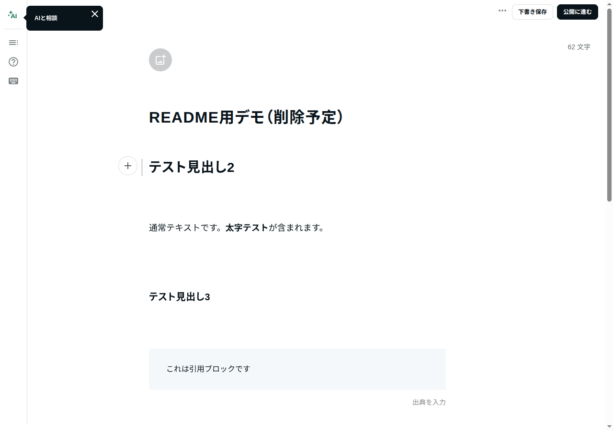

# note-scripts

note.com の記事管理を CLI で自動化する Playwright スクリプト集。

下書き作成・編集・公開・一覧取得をコマンドラインから実行できます。

## 必要環境

- Node.js 18 以上
- Chromium（`npm run install-browsers` でインストール）
- **有人ディスプレイ環境**（headedモード必須。WSL2/Linux でも `DISPLAY` 設定が必要）

## インストール

```bash
git clone https://github.com/naginata63/note-scripts.git
cd note-scripts
npm install
npm run install-browsers
```

## 認証情報の設定

環境変数で note.com のログイン情報を渡します。`.env` ファイルや `~/.bashrc` に設定してください:

```bash
export NOTE_EMAIL="your-email@example.com"
export NOTE_PASSWORD="your-password"
```

## 使い方

### 下書き一覧

```bash
node scripts/note-edit.js --action=list
```

### 下書き作成

```bash
node scripts/note-edit.js --action=create \
  --title="記事タイトル" \
  --body="本文テキスト"
```

### 記事編集

```bash
node scripts/note-edit.js --action=edit \
  --url="https://note.com/username/n/xxxxxxxx" \
  --body="新しい本文"
```

### 記事公開

```bash
node scripts/note-edit.js --action=publish \
  --url="https://note.com/username/n/xxxxxxxx"
```

### Markdown記法で下書き作成

`--body-file` で Markdownファイルを指定すると、noteエディタ上でリッチテキストに自動変換されます。

```bash
node scripts/note-edit.js --action=create \
  --title="記事タイトル" \
  --body-file=article.md
```

#### 対応するMarkdown記法

| 記法 | 変換結果 |
|------|---------|
| `## 見出し` | h2見出し |
| `### 見出し` | h3見出し |
| `**太字**` | **太字** |
| `[テキスト](URL)` | リンク |
| `> 引用` | 引用ブロック |
| `- 箇条書き` | 箇条書きリスト |
| `` `コード` `` | コードブロック |
| 空行 | 段落区切り |

※ テーブル記法はnote非対応のため自動スキップされます（警告メッセージ表示）。



## 動作確認環境

| 項目 | バージョン |
|------|-----------|
| OS | Ubuntu 24.04 LTS (WSL2) |
| Node.js | v20.20.0 |
| Playwright | 1.58.2 |
| Chromium | Playwright同梱版 |

## 制限事項

- **headedモード専用**: ブラウザウィンドウが表示される環境が必要です
- サーバー環境（ヘッドレス専用）では動作しません
- note.com のUI変更によりセレクタが合わなくなる場合があります

## ファイル構成

```
scripts/
  note-edit.js    # メインスクリプト
  selectors.md    # セレクタ調査メモ（開発者向け参考情報）
```

## ライセンス

MIT
