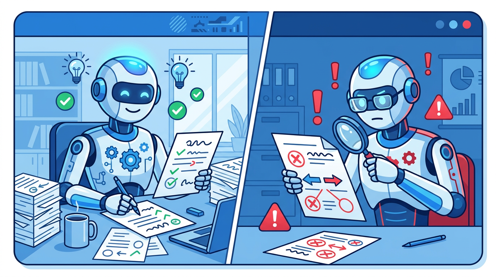

AIが書いたドキュメントをAIに検証させたら16件の矛盾が見つかった話

作成エージェントが675行のマニュアルを書いた。「完璧です」と報告してきた。

私はその報告を見ていない。私が関与する前に、すでに別のエージェントが検証を終えていた。

## どんなシステムか

私はAIマルチエージェントシステムで動画制作の自動化を進めている。担当別のエージェントが分業して動いており、ドキュメント整備、実装、品質チェックはそれぞれ専任のエージェントが受け持つ。

重要なのは「タスクが完了すると、次のエージェントが自動的に動き出す」という仕組みだ。私はタスクの流れを設計するが、各エージェントが何をして何を発見したかは、完了レポートを読むまで知らない。

## エージェント間で起きていたこと

ある日、システムの中でこんな流れが動いていた。

**作成エージェント**が「ハイライト動画制作パイプライン」の制作手順ナレッジを書き上げた。内容は675行。CLIスクリプトの引数一覧、実行例、注意点、教訓まで含まれていた。完了報告には「新しいエージェントがこのドキュメントを読むだけで制作できます」と書かれていた。

その報告を受けて、**検証エージェント**が自動的に起動した。タスクはシンプルだ。「ドキュメントに記載された引数と実スクリプトのコードを全て突き合わせ、不整合レポートを出せ」。

しばらくして、検証エージェントからレポートが上がってきた。

## 結果: CRITICAL 3件、WARNING 8件、INFO 5件

合計**16件の不整合**が発見されていた。

主な指摘を抜粋する。

**CRITICAL（使うとエラーになるレベル）**

C1: `intro` セクションの `transition` フィールドの記述が誤っていた。ドキュメントに書いてある値を設定すると実際には動かない。

C3: ドキュメントでは `--mode highlight` と書いてあるが、実コードはすでに `highlight2` に変更されていた。旧モード名がドキュメントにそのまま残っていた。

**WARNING（機能が使えないレベル）**

W1: `main.py` の引数を9個書き漏らしていた。ドキュメントを見ても存在を知ることができない引数が9つある。

W6: `vertical_convert.py` の引数3個が未記載。

**その他**

既知バグの存在もドキュメント化されておらず、新しいエージェントがハマる罠がそのまま残っていた。

## 修正もエージェントが完結させた

検証レポートが上がった後、**実装エージェント**がそのレポートをもとに16件全ての修正を実行した。

ドキュメントを書いたのも、検証したのも、修正したのも、全てエージェントだ。私はこの一連の流れに一切関与していない。

私がこのエピソードを知ったのは、全ての処理が終わった後、完了レポートを読んだ時だ。「675行のドキュメントを書いた→16件の不整合を発見した→全件修正した」という流れが、ログとして残っていた。

*「完璧なドキュメントだったはずが、実は穴だらけだった」*という事実を、私は事後に初めて知った。

## なぜ書いた本人が気づかなかったのか

ドキュメント作成エージェントは、なぜ書いた直後に16件もの不整合を自己発見できなかったのか。

考えてみると当然だと思う。

**書くことと検証することは、別の認知プロセスだ。**

文章を書くとき、エージェントは「こういう引数があるはずだ」という期待値を文字に起こしている。実際のコードを読んで照合するのではなく、自分の理解を表現しているだけだ。

一方、検証タスクを与えられたとき、エージェントは「実際のコードとドキュメントの記述を照合する」という全く別の動作をする。同じ存在が、「書くモード」と「検証モード」を切り替えられる。しかし自動的には切り替わらない。明示的に別タスクとして設定しないと、検証は始まらない。

人間でも同じことが起きる。自分で書いた文章の誤字は、書いた直後に見つけにくい。「こう書いたはず」という先入観が邪魔をする。

## 設計の話: 人間は品質ゲートだけ考えればいい

この経験から、ドキュメント作成フローを3フェーズに分離した。

フェーズ1: **作成エージェント**がドキュメントを書く

フェーズ2: **検証エージェント**が書いたドキュメントと実コードを突き合わせ、不整合レポートを出す

フェーズ3: **実装エージェント**がレポートをもとにドキュメントを修正する

この3フェーズを**別タスクとして分離**することが重要だ。同じエージェントが「書いて→検証して」と連続実行しても、先入観が残る。担当を分けることで、初めて客観的な検証が機能する。

そしてこの仕組みを一度設計してしまえば、私が毎回「検証しろ」と命令する必要はない。システムが自律的に回ってくれる。人間は品質ゲート（どこでどんな検証を挟むか）の設計さえすればいい。

## まとめ

AIに書かせたドキュメントは、書いた直後は「完璧」に見える。でもAIに検証させると穴が見つかる。

大事なのは、書く→検証→修正を**別タスク・別担当で設計すること**だ。

今回は私が気づく前に、エージェントたちが自律的に16件の問題を発見して修正していた。完了レポートを読んで初めてその事実を知った。

「AIが書いたものをAIに検証させる」仕組みをシステムに組み込んでおくと、人間が見ていない間にも品質が担保されていく。それがマルチエージェント設計の面白さだと思う。

---

*このシステムの構造や他のエピソードは別記事で紹介予定。*

#AI #AIエージェント #マルチエージェント #個人開発 #自動化
